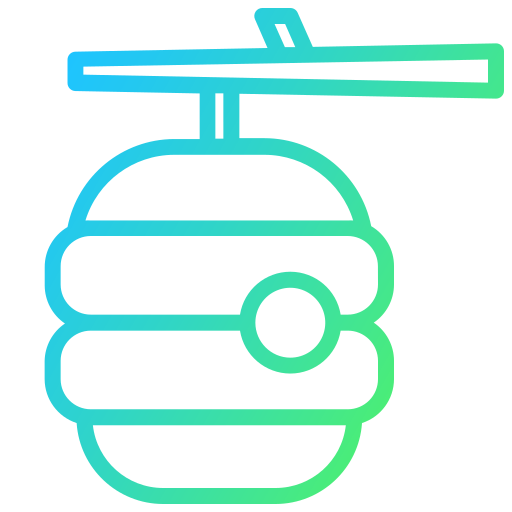

<h1 align="center">BugHive</h1>

<!-- Improved compatibility of back to top link: See: https://github.com/othneildrew/Best-README-Template/pull/73 -->

<a name="readme-top"></a>

<!-- PROJECT SHIELDS -->
<!--
*** I'm using markdown "reference style" links for readability.
*** Reference links are enclosed in brackets [ ] instead of parentheses ( ).
*** See the bottom of this document for the declaration of the reference variables
*** for contributors-url, forks-url, etc. This is an optional, concise syntax you may use.
*** https://www.markdownguide.org/basic-syntax/#reference-style-links
-->

[![Contributors][contributors-shield]][contributors-url]
[![Forks][forks-shield]][forks-url]
[![Stargazers][stars-shield]][stars-url]
[![Issues][issues-shield]][issues-url]
[![MIT License][license-shield]][license-url]
[![LinkedIn][linkedin-shield]][linkedin-url]

<!-- PROJECT LOGO -->
<br />
<div align="center">
  <a href="https://github.com/mcmurray0125/bughive">
    
  </a>

  <h3 align="center">BugHive - a project management application</h3>

  <p align="center">
    View the <a href ="https://www.bughive.xyz">Live Site</a>
    <br />
    <a href="https://github.com/mcmurray0125/bughive">Explore the<strong> code »</strong></a>
    <br />
    <br />
    <a href="#video-demos">Video Demos</a>
    ·
    <a href="https://github.com/mcmurray0125/bughive/issues">Report Bug</a>
    ·
    <a href="https://github.com/mcmurray0125/bughive/issues">Request Feature</a>
  </p>
</div>

<!-- TABLE OF CONTENTS -->
<details>
  <summary>Table of Contents</summary>
  <ol>
    <li>
      <a href="#about-the-project">About The Project</a>
      <ul>
        <li><a href="#built-with">Built With</a></li>
      </ul>
    </li>
    <li>
      <a href="#view-the-live-project">View the Live Project</a>
      <ul>
      </ul>
    </li>
    <li><a href="#video-demos">Video Demos</a></li>
    <li><a href="#roadmap">Roadmap</a></li>
    <li><a href="#contributing">Contributing</a></li>
    <li><a href="#license">License</a></li>
    <li><a href="#contact">Contact</a></li>
    <li><a href="#acknowledgments">Acknowledgments</a></li>
  </ol>
</details>

<!-- ABOUT THE PROJECT -->

## About The Project

[![Product Name Screen Shot][product-screenshot]](https://github.com/mcmurray0125/bughive)

BugHive is an full stack ticket-managing system intended to be used within an organization. Technologies include Node.js / express, PostgreSQL database, and React frontend.
When users login or sign up, passwords are encrpyted with bcrypt and logins are validated with JWT authentication tokens. UI is mobile-responsive and designed with simplicity and cohesiveness in mind.
In the dashboard, Chart.js pie charts display a summary of the tickets in the user's account.

_What you can do with BugHive:_

- Login securely with JWT authentication.
- Create projects and add other users to those projects.
- Create tickets within projects, and assign users to specific tickets.
- Add comments to tickets to encourage collaboration when working on projects.
- Edit existing projects and tickets.
- View as summary of created tickets in Chart.js visualizations.
- Edit user info (if admin privileges)

_Things I learned building this project:_

- Using controllers to organize and handle a variety of http requests.
- Adding middleware to ensure authentication before proceeding w/ requests.
- Using the new CreateBrowserRouter in react-router
- Creating base layouts in React to render page outlets based on url path.
- The importance of nesting to create legible and maintainable code.
- Taking design inspiration from multiple sources (CreativeTim, Figma designers...)
- Loading animations make the UX better!

<br>

Thanks for checking out BugHive! Photos, videos, and more info below!

<p align="right">(<a href="#readme-top">back to top</a>)</p>

### Built With

<br>

- [![POSTGRESQL][postgresql]][postgresql-url]
- [![EXPRESS][express.js]][express-url]
- [![REACT][react.js]][react-url]
- [![NODE][node.js]][node-url]
- [![JavaScript][javascript.com]][javascript-url]
- [![HTML5][html.org]][html-url]
- [![BOOTSTRAP][bootstrap.com]][bootstrap-url]
- [![CSS][css.org]][css-url]

<p align="right">(<a href="#readme-top">back to top</a>)</p>

<!-- GETTING STARTED -->

## View The Live Project

Visit a live version of BugHive <a href ="https://www.bughive.xyz">here</a>

<p align="right">(<a href="#readme-top">back to top</a>)</p>
<!-- USAGE EXAMPLES -->

## Video Demos

Coming soon...

<p align="right">(<a href="#readme-top">back to top</a>)</p>

<!-- ROADMAP -->

## Roadmap

- [x] Add Loading states w/ loading animations.
- [x] Responsive design.
- [x] Charts with Chart.js
- [ ] Pagination for tables.

See the [open issues](https://github.com/mcmurray0125/bughive/issues) for a full list of proposed features (and known issues).

<p align="right">(<a href="#readme-top">back to top</a>)</p>

<!-- CONTRIBUTING -->

## Contributing

Contributions are what make the open source community such an amazing place to learn, inspire, and create. Any contributions you make are **greatly appreciated**.

If you have a suggestion that would make this better, please fork the repo and create a pull request. You can also simply open an issue with the tag "enhancement".
Don't forget to give the project a star! Thanks again!

1. Fork the Project
2. Clone your forked repo:

```sh
git clone https://github.com/YOUR-USERNAME/bughive.git
```

3. Install npm packages in client & server folders.

```sh
cd client
npm install
```

```sh
cd server
npm install
```

4. Create your Feature Branch (`git checkout -b feature/AmazingFeature`)
5. Create a .env file in the server directory of the project.
6. Open the .env file and add the following variables, replacing the values with your own:

```
PORT=

PGUSER=
PGHOST=
PGPASSWORD=
PGDATABASE=bughive
PGPORT=

JWT_SECRET=
```

7. Create a new PostgreSQL database with the name matching the PGDATABASE variable (the schema file expects bughive). You can use your preferred method to create a database, such as the PostgreSQL command-line tool (psql).

```
postgres=# create database bughive;
```

8. Download the database schema file to set up your database.
   [Download bughive_schema.pgsql](client/public/bughive_schema.pgsql)

9. Import the schema into your database from the downloaded file

```
psql bughive < /path/to/bughive_schema.pgsql
```

8. Run Server with `npm start`

```sh
npm run dev
```

8. Run Cient with `npm run dev`

```sh
npm run dev
```

6. Commit your Changes (`git commit -m 'Add some feature or fix'`)
7. Push to the Branch (`git push origin feature/amazing-feature`)
8. Open a Pull Request

<p align="right">(<a href="#readme-top">back to top</a>)</p>

<!-- LICENSE -->

## License

Distributed under the MIT License. See `LICENSE.txt` for more information.

<p align="right">(<a href="#readme-top">back to top</a>)</p>

<!-- CONTACT -->

## Contact

Michael Murray - [@LinkedIn](https://www.linkedin.com/in/michaelchristophermurray/) - mcmurray0125@gmail.com

Personal Website - [https://michael-murray.netlify.app](https://michael-murray.netlify.app)

<p align="right">(<a href="#readme-top">back to top</a>)</p>

<!-- ACKNOWLEDGMENTS -->

## Acknowledgments

Here are some resources that I have found helpful:

- [PostgreSQL Tutorial](https://www.postgresqltutorial.com/)
- [React Bootstrap](https://react-bootstrap.github.io/)
- [Font Awesome](https://fontawesome.com)
- [freeCodeCamp](https://www.youtube.com/@freecodecamp)
- [Img Shields](https://shields.io)
- [Choose an Open Source License](https://choosealicense.com)
- [Flaticon](https://www.flaticon.com/)

<p align="right">(<a href="#readme-top">back to top</a>)</p>

<!-- MARKDOWN LINKS & IMAGES -->
<!-- https://www.markdownguide.org/basic-syntax/#reference-style-links -->

[contributors-shield]: https://img.shields.io/github/contributors/mcmurray0125/bughive.svg?style=for-the-badge
[contributors-url]: https://github.com/mcmurray0125/bughive/graphs/contributors
[forks-shield]: https://img.shields.io/github/forks/mcmurray0125/bughive.svg?style=for-the-badge
[forks-url]: https://github.com/mcmurray0125/bughive/network/members
[stars-shield]: https://img.shields.io/github/stars/mcmurray0125/bughive.svg?style=for-the-badge
[stars-url]: https://github.com/mcmurray0125/bughive/stargazers
[issues-shield]: https://img.shields.io/github/issues/mcmurray0125/bughive.svg?style=for-the-badge
[issues-url]: https://github.com/mcmurray0125/bughive/issues
[license-shield]: https://img.shields.io/github/license/mcmurray0125/bughive.svg?style=for-the-badge
[license-url]: https://github.com/mcmurray0125/bughive/blob/main/LICENSE.txt
[linkedin-shield]: https://img.shields.io/badge/-LinkedIn-black.svg?style=for-the-badge&logo=linkedin&colorB=555
[linkedin-url]: https://linkedin.com/in/michaelchristophermurray
[product-screenshot]: ./client/public/bughive-screenshot.png
[express.js]: https://img.shields.io/badge/express-000000?style=for-the-badge&logo=express&logoColor=white
[express-url]: https://expressjs.com/
[node.js]: https://img.shields.io/badge/node.js-026e00?style=for-the-badge&logo=nodedotjs&logoColor=white
[node-url]: https://nodejs.org/en
[postgresql]: https://img.shields.io/badge/postgresql-212121?style=for-the-badge&logo=postgresql&logoColor=679ac7
[postgresql-url]: https://www.postgresql.org/
[next.js]: https://img.shields.io/badge/next.js-000000?style=for-the-badge&logo=nextdotjs&logoColor=white
[next-url]: https://nextjs.org/
[react.js]: https://img.shields.io/badge/React-20232A?style=for-the-badge&logo=react&logoColor=61DAFB
[react-url]: https://reactjs.org/
[vue.js]: https://img.shields.io/badge/Vue.js-35495E?style=for-the-badge&logo=vuedotjs&logoColor=4FC08D
[vue-url]: https://vuejs.org/
[angular.io]: https://img.shields.io/badge/Angular-DD0031?style=for-the-badge&logo=angular&logoColor=white
[angular-url]: https://angular.io/
[svelte.dev]: https://img.shields.io/badge/Svelte-4A4A55?style=for-the-badge&logo=svelte&logoColor=FF3E00
[svelte-url]: https://svelte.dev/
[laravel.com]: https://img.shields.io/badge/Laravel-FF2D20?style=for-the-badge&logo=laravel&logoColor=white
[laravel-url]: https://laravel.com
[bootstrap.com]: https://img.shields.io/badge/Bootstrap-563D7C?style=for-the-badge&logo=bootstrap&logoColor=white
[bootstrap-url]: https://getbootstrap.com
[jquery.com]: https://img.shields.io/badge/jQuery-0769AD?style=for-the-badge&logo=jquery&logoColor=white
[jquery-url]: https://jquery.com
[javascript.com]: https://img.shields.io/badge/JavaScript-F7DF1E?logo=javascript&logoColor=000&style=for-the-badge
[javascript-url]: https://javascript.com/
[html.org]: https://img.shields.io/badge/HTML5-E34F26?logo=html5&logoColor=fff&style=for-the-badge
[html-url]: https://w3.org/html/
[css.org]: https://img.shields.io/badge/CSS3-1572B6?logo=css3&logoColor=fff&style=for-the-badge
[css-url]: https://www.w3.org/Style/CSS/Overview.en.html

<!-- This README.md file contains content written by another person. View the source code of the original creator here: https://github.com/othneildrew/Best-README-Template/blob/master/LICENSE.txt -->
